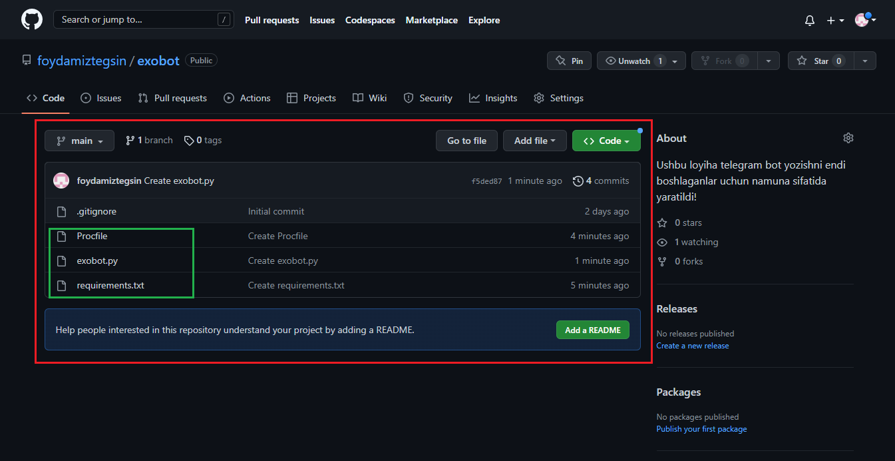
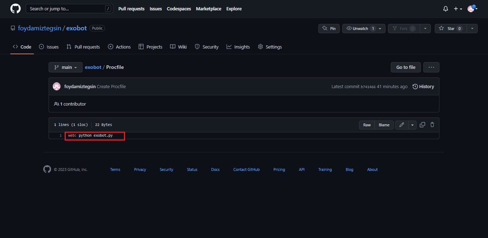
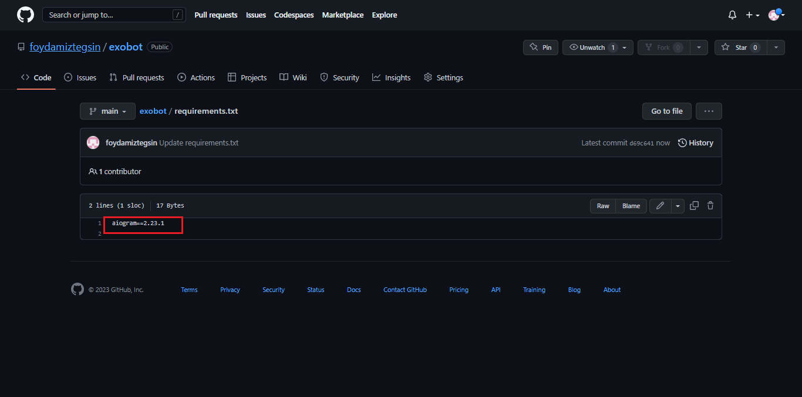
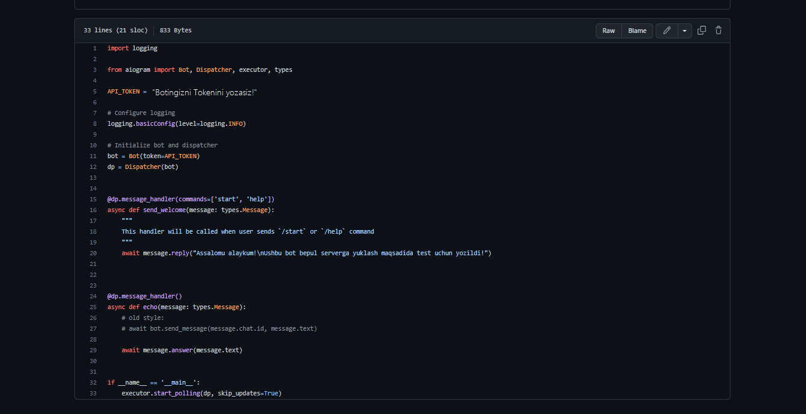

# **Botimizni [Railway](https://railway.app) saytiga joylash** 

# __Yuklash ikkita bosqichdan iborat__

# __*Github* orqali yuklashni ko'rib chiqamiz! (agar sizga *Github* mavjud bo'lmasa CLI bosqichiga o'tishingiz mumkin)__

- **Github** profilimizda loyiha kodlarimiz yuklagan bo'lishim zarur!
- Loyihamizda quydagi fayllardan tashkil topgan bo'lishi kerak!
 

    - Botimizni kodlari jamlangan fayl(exobot.py)
    - Procfile (Railway saytida loyihamizni ishga tushirish uchun kerakli fayl
    - requirements.txt (loyihamiz uchun kerakli paketlarni versiyalari bilan birgalikdagi talablar fayli)
    
 
 
 
 - exobot.py o'rnida botingizni ishga tushiradigan fayl nomini yozishingiz zarur!

 
 
 
 
 - requirements.txt (loyihamiz uchun kerakli paketlarni versiyalari bilan birgalikdagi talablar fayli!

 
 
 
 - Botimizni kodlari jamlangan fayl(exobot.py)!
 

# __*CLI(terminal)* orqali yuklashni ko'rib chiqamiz!__

- ПУСК+R knoplarini bosish orqali  kichik bir oyna ochiladi

Oyna ichiga cmd yozishingiz kerak
-  *OK* kopkani bosing!

- Terminal (cmd) oynasi ochiladi

- git yozing va *Enter*-ni bosing

- rasmdagidek xatolik chiqsa siz ushbu manzildan  👉 [GIT](https://git-scm.com/downloads)-ni yuklab oling(__Windows uchun__) va **Ikkinchi bosqich**-ga o'ting

- agar sizda ushbu ko'rinish chiqsa siz **3-bosqichga** o'tishingiz mumkin

# __Ikkinchi bosqich__

