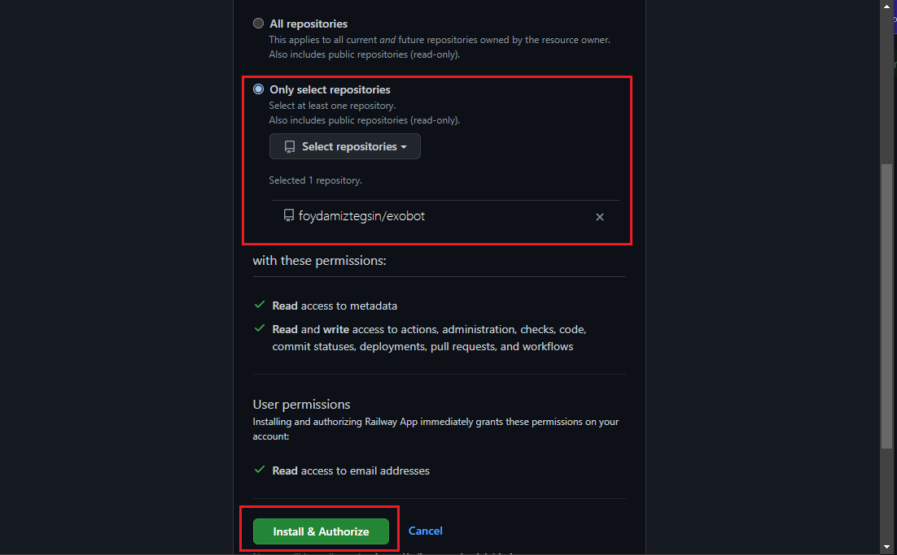

# **Botimizni [Railway](https://railway.app) saytiga joylash** 

# __Birinchi bosqich **GITHUB**__

# __*Github* orqali yuklashni ko'rib chiqamiz! (agar sizga *Github* mavjud bo'lmasa CLI bosqichiga o'tishingiz mumkin)__

- **Github** profilimizda loyiha kodlarimiz yuklagan bo'lishim zarur!
- Loyihamizda quydagi fayllardan tashkil topgan bo'lishi kerak!

    - Botimizni kodlari jamlangan fayl(exobot.py)
    - Procfile (Railway saytida loyihamizni ishga tushirish uchun kerakli fayl
    - requirements.txt (loyihamiz uchun kerakli paketlarni versiyalari bilan birgalikdagi talablar fayli)
    

# __exobot.py o'rnida botingizni ishga tushiradigan fayl nomini yozishingiz zarur!__
 
 
 

 

# __requirements.txt (loyihamiz uchun kerakli paketlarni versiyalari bilan birgalikdagi talablar fayli!__
 
 
 

# __Botimizni kodlari jamlangan fayl(exobot.py)!__
 
 
 

# __Ikkinchi bosqich **Railway saytidan ro'yxatdan o'tish va kodlarni GITHUB orqali yuklash**__

> [Railway](https://railway.app) saytiga kirib **Login** - bo'limiga kiring!
 

> **GITHUB** orqali Login qilamiz
 

> **GITHUB** orqali Login qilishim uchun brovzeringizda **GITHUB** - ga login qilgan bo'lishingiz zarur!
 

> *Rasmda ko'rsatilgan oyna ochiladi ** +New Project** - yarating!
- **Eslatma** Agar *GITHUB* - giz yangi ochilgan bo'lsa sizda Visa Card kitishni so'rashi mumkin!
 

> **GITHUB** orqali Deploy qilishni tanlang!
 

> **Configure Github App** tanlang!
 

> **Rasmdagidek bajaring va loyihangizni tanlng**
 

> **GITHUB parolingizni yozing va kuting....**
 

> **Building... bo'lishini kuting....**
 

# __*CLI(terminal)* orqali yuklashni ko'rib chiqamiz!__

- ПУСК+R knoplarini bosish orqali  kichik bir oyna ochiladi

Oyna ichiga cmd yozishingiz kerak
-  *OK* kopkani bosing!

- Terminal (cmd) oynasi ochiladi

- git yozing va *Enter*-ni bosing

- rasmdagidek xatolik chiqsa siz ushbu manzildan  👉 [GIT](https://git-scm.com/downloads)-ni yuklab oling(__Windows uchun__) va **Ikkinchi bosqich**-ga o'ting

- agar sizda ushbu ko'rinish chiqsa siz **3-bosqichga** o'tishingiz mumkin

# __Ikkinchi bosqich__

